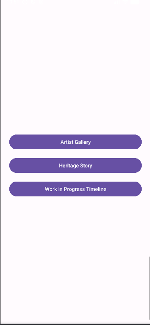

# 🏛️ Shilpa-Kala Showcase

> **Connecting Ancient Art with the Modern Buyer**
> A Digital Gallery for Traditional Stone & Wood Carvers of India 🇮🇳

---

## 📖 About the Project

**Shilpa-Kala Showcase** is an Android app that serves as a premium digital portfolio platform for traditional stone and wood carvers (Shilpis) from places like **Shivarapatna**. These master craftsmen create world-class idols and sculptures but have no digital presence to reach national and international buyers.

This app bridges the gap between **Ancient Art** and the **Modern Buyer** — empowering rural artisans with a global window to showcase their craft.

---

## ✨ Features

| Feature | Description |
|--------|-------------|
| 🖼️ **Artist Portfolio** | High-quality image gallery of sculptures |
| ⏳ **Work-in-Progress Timeline** | Shows how stone transforms into a statue |
| 📲 **Order Inquiry (WhatsApp)** | One-tap enquiry with pre-filled WhatsApp message |
| 📜 **Heritage Story** | Educational section on Hoysala, Chalukya carving styles |
| 🔍 **Zoom Feature** | Pinch-to-zoom to see intricate carving details |
| 🔐 **Login Screen** | Secure sign in to Artisan Digital Portfolio |

---

## 🛠️ Tech Stack

- **Language:** Kotlin
- **Platform:** Android (API 21+)
- **Image Loading:** Glide
- **WhatsApp Integration:** Android Intents

---

## 📱 Screenshots

---

## 🚀 Getting Started

1. Clone the repository
   git clone https://github.com/shreyarajgopal123-art/ShilpaKalaShowcase2.git

2. Open in Android Studio

3. Build and Run on your device or emulator

---

## 🌍 Impact Goals

- 🧑‍🎨 Artisanal Empowerment — Giving rural masters a global window
- 📦 Export Potential — Facilitating Make in India for traditional crafts
- 🏺 Heritage Preservation — Documenting rare carving techniques digitally

---

## ✅ Success Criteria

- App handles at least 20 high-resolution images without slowing down
- Inquiry button includes the specific Product ID in the WhatsApp message
- UI feels like a premium art gallery — minimalist and clean

---

## 👩‍💻 Developer

**shreyarajgopal123-art**
GitHub: https://github.com/shreyarajgopal123-art/ShilpaKalaShowcase2

---

> "Preserving India's ancient craft heritage, one digital gallery at a time." 🪨✨
